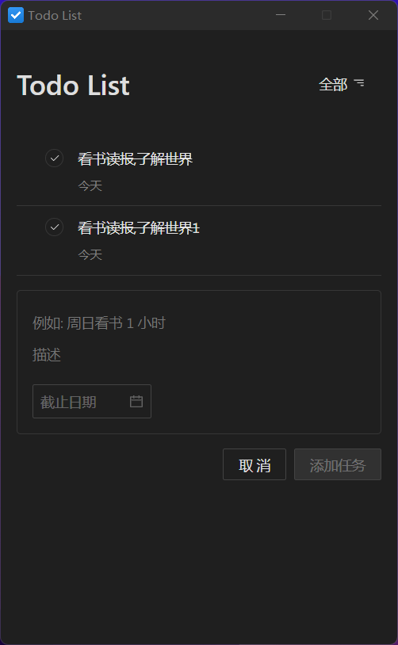
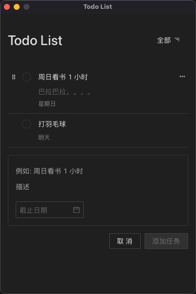

# tauri app

基于 Tauri + React + Ts 构建的todo app

## windows


## macos (apple m1)

[下载体验](./demo/Todo%20List_0.1.0_aarch64.dmg)
## 运行
```bash
git clone https://github.com/yue1123/tauri-app-todo
```

```bash
pnpm install
```

```bash
pnpm run tauri_dev
```