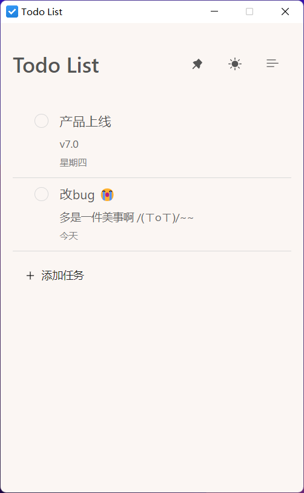
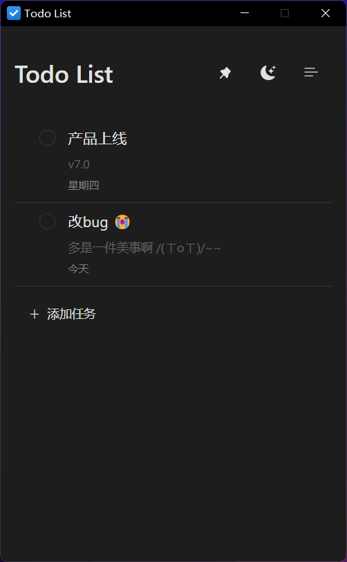
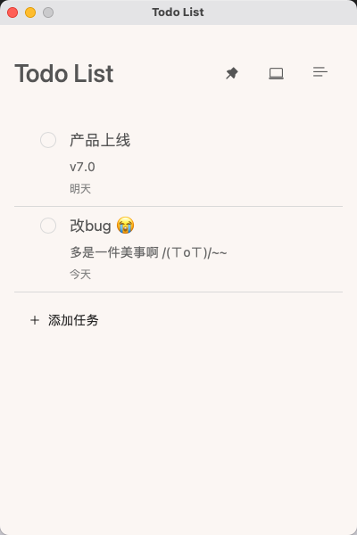
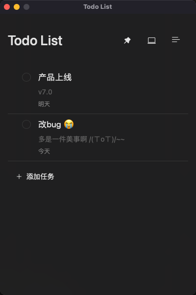

# tauri app

基于 Tauri + React + Ts 构建的精美 todo app 示例

## 功能

1. todo
    1. 增加
    2. 删除
    3. 拖拽排序
    4. 编辑
    5. 过滤状态
2. 主题
    1. 浅色
    2. 深色
    3. 跟随系统
3. 窗口置顶
4. 磨砂透明背景(macos)
5. 数据缓存
## windows

<p>
  
  
  
  
</p>

[下载体验](./release/Todo%20List_0.1.0_x64_en-US.msi)

## macos (apple m1)

<p>
  
  
  
  
</p>

[下载体验](./release/Todo%20List_0.1.0_aarch64.dmg)

## 运行

```bash
git clone https://github.com/yue1123/tauri-app-todo
```

```bash
pnpm install
```

```bash
pnpm run tauri_dev
```
